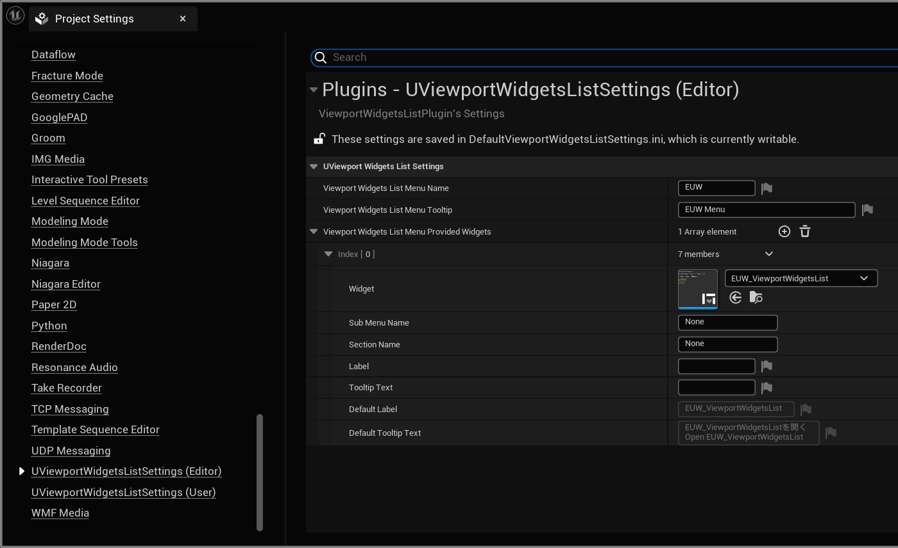
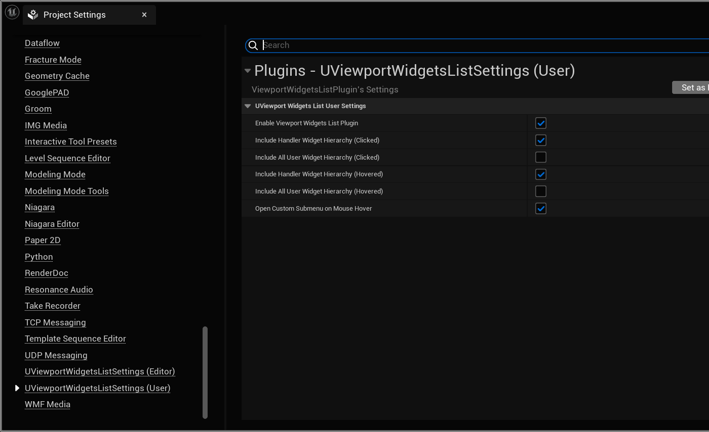

# UE5_ViewportWidgetsList プラグイン

## エディタ内でのウィジェット一覧をより迅速に表示するプラグイン

このプラグインはダリアさんのZenn投稿記事 ([【UE5】C++を使って今どのWidgetが表示されているのか確認する機構を作る](https://zenn.dev/daria_nicht/articles/ue5-add-viewport-names)) から着想を得て作られています  

Unreal Engine 5 のエディタ内で、現在ビューポートに表示されているウィジェットをリアルタイムで一覧表示し、クリック・ホバーしたウィジェットも即座に把握できるツールです  

### 機能・特徴

- リアルタイムウィジェット一覧表示

  現在ビューポート内でアクティブなすべてのウィジェットをリスト化。デバッグやレイアウト調整を行う際のサポートとして  

- クリック・ホバー検出機能

  最後にクリック/ホバーしたウィジェットを特定し、デバッグをスムーズに  

- エディタメニューに統合

  独自のサブメニューを追加し、ワンクリックで機能にアクセス可能  

## 目次

- [UE5\_ViewportWidgetsList プラグイン](#ue5_viewportwidgetslist-プラグイン)
	- [エディタ内でのウィジェット一覧をより迅速に表示するプラグイン](#エディタ内でのウィジェット一覧をより迅速に表示するプラグイン)
		- [機能・特徴](#機能特徴)
	- [目次](#目次)
	- [プラグインが提供するもの](#プラグインが提供するもの)
		- [EUW\_ViewportWidgetsList (ウィジェット一覧表示)](#euw_viewportwidgetslist-ウィジェット一覧表示)
			- [特徴](#特徴)
			- [\[表示例\]](#表示例)
		- [サブメニュー (エディタ上部メニューに統合)](#サブメニュー-エディタ上部メニューに統合)
		- [オプション](#オプション)
			- [共通オプション](#共通オプション)
				- [設定可能項目-共通](#設定可能項目-共通)
			- [個人オプション](#個人オプション)
				- [設定可能項目-個人](#設定可能項目-個人)
	- [UE インストールの方法](#ue-インストールの方法)
	- [Visual Studio インストールの方法](#visual-studio-インストールの方法)
	- [プラグインのダウンロード方法](#プラグインのダウンロード方法)
		- [プラグインの配置](#プラグインの配置)
	- [プラグインのビルド](#プラグインのビルド)
		- [ソリューションファイル(.sln)が生成されないときは](#ソリューションファイルslnが生成されないときは)
	- [お問い合わせ](#お問い合わせ)
		- [問題報告](#問題報告)

## プラグインが提供するもの

プラグインは、一つの Editor Utility Widget (EUW) をそれを開くためのサブメニューを提供します

### EUW_ViewportWidgetsList (ウィジェット一覧表示)

このプラグインのメイン機能です
現在エディタビューポートに表示されているウィジェットの一覧をリアルタイムで表示します
さらに、クリックしたウィジェットやホバーしたウィジェットも表示します

#### 特徴

- 現在のレベル名の表示
- 表示中のすべてのウィジェット名をリストアップ。個数と名前を表示
- 最後にクリック/ホバーしたウィジェット
- ボタンで機能の一時停止が可能

#### \[表示例\]

 

### サブメニュー (エディタ上部メニューに統合)

エディタの上部メニューに専用のサブメニューを追加し、手軽に EUW を開くことができます  
通常の手順でEUWを開くよりも、手間が省けます  

### オプション

#### 共通オプション

エディタの「Project Settings」内の
\[UViewportWidgetsListSettings (Editor)\] と表示される項目です

##### 設定可能項目-共通

    メニュー名 (ViewportWidgetsListMenuName)
    メニューの説明 (ViewportWidgetsListMenuTooltip)
    提供するウィジェット (ViewportWidgetsListMenuProvidedWidgets)

#### 個人オプション

エディタの「Project Settings」内の
\[UViewportWidgetsListSettings (User)\] と表示される項目です
個人オプションは、EditorPerProjectUserSettings に保存されます

##### 設定可能項目-個人

    プラグインの有効/無効 (bEnableViewportWidgetsListPlugin)
    クリック/ホバー時のウィジェット階層表示 (bIncludeHandlerWidgetHierarchyClicked など) (表示を少なくできます)
    マウスホバーでサブメニューを開く (bOpenCustomSubmenuOnMouseHover)

## UE インストールの方法

このプラグインは Unreal Engine 5.3 向けに作られたています  

[Unreal Engine を*ダウンロード*する](https://www.unrealengine.com/ja/download)  
[Unreal Engine を*インストール*する](https://dev.epicgames.com/documentation/ja-jp/unreal-engine/installing-unreal-engine)  

## Visual Studio インストールの方法

C++でのビルドを行うため、Visual Studio などのIDEが必要です  
(ここでは Visual Studio のダウンロードリンクを紹介します)  
[最新の無料バージョンをダウンロードする](https://visualstudio.microsoft.com/ja/vs/community/)  
このサイトも詳しい→[ue5study.com](https://ue5study.com/how/unrealengine-packaging-visualstudio-settings/)  

## プラグインのダウンロード方法

後悔ページのトップに行き \[Code\] ボタン → \[Download ZIP\] ボタンを押して、ダウンロードします  
[トップ](https://github.com/kiruru002/ViewportWidgetsListPlugin)  
[最新版ダウンロードURL(ダウンロードが行われます)](https://github.com/kiruru002/ViewportWidgetsListPlugin/archive/refs/heads/main.zip)  

### プラグインの配置

- UE プロジェクトフォルダ (.uproject ファイルと同じ位置) に Plugins フォルダを作成  
- ダウンロードした ZIP を解凍し、 Plugins フォルダ内に配置  

## プラグインのビルド

.uproject を右クリックし、 \[Generate Visual Studio project files.\] を選択  

.sln ファイルを開き、プロジェクトをビルド  

### ソリューションファイル(.sln)が生成されないときは

もし以下のようなエラーが出力された場合には、プロジェクトに空のソースコードを追加することでエラーを回避できます  

> This project does not have any source code. You need to add C++ source files to the project from the Editor before you can generate project files.

ソースコードのないプロジェクトでは、先にソースコードを追加する必要があります  
エディタから \[New C++ Class\] を選択し、プロジェクトに空の C++ クラスなどを追加してください  

1. Tools → New C++ Class... を選択
2. None → Next → Create Class をクリック
3. OK → Yes でクラスを作成

## お問い合わせ

- 開発者: kiruru002
- Github: [ViewportWidgetsListPlugin](https://github.com/kiruru002/ViewportWidgetsListPlugin)

### 問題報告

- [Github issues](https://github.com/kiruru002/ViewportWidgetsListPlugin/issues)
