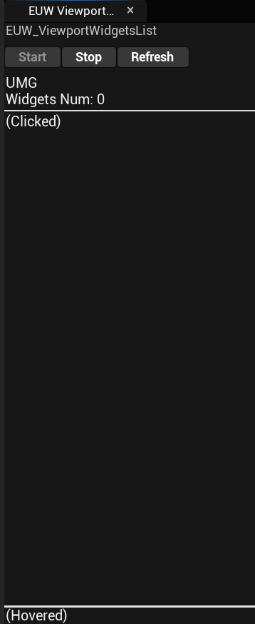
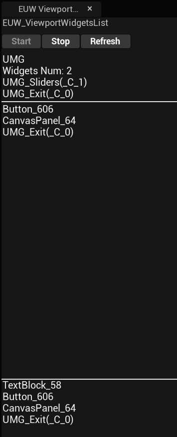

# UE5_ViewportWidgetsList

このプラグインはダリアさんのZenn投稿記事 ([【UE5】C++を使って今どのWidgetが表示されているのか確認する機構を作る](https://zenn.dev/daria_nicht/articles/ue5-add-viewport-names)) から着想を得て作られています  

## 目次

- [UE5\_ViewportWidgetsList](#ue5_viewportwidgetslist)
	- [目次](#目次)
	- [プラグインが提供する機能](#プラグインが提供する機能)
		- [EUW\_ViewportWidgetsList](#euw_viewportwidgetslist)
		- [サブメニュー](#サブメニュー)
		- [オプション](#オプション)
			- [共通オプション](#共通オプション)
			- [個人オプション](#個人オプション)
	- [UE インストールの方法](#ue-インストールの方法)
	- [Visual Studio インストールの方法](#visual-studio-インストールの方法)
	- [プラグインのダウンロード方法](#プラグインのダウンロード方法)
		- [ダウンロードした後のプラグインの配置](#ダウンロードした後のプラグインの配置)
	- [プラグインのビルド](#プラグインのビルド)
		- [ソリューションファイル(.sln)が生成されないときは](#ソリューションファイルslnが生成されないときは)
	- [プラグインの設定](#プラグインの設定)

## プラグインが提供する機能

プラグインは、一つの Editor Utility Widget (EUW) をそれを開くためのサブメニューを提供します

### EUW_ViewportWidgetsList

EUW_ViewportWidgetsList は画面上のウィジェット名を表示すると同時に、マウスで最後にクリックしたウィジェット、ホバーしたウィジェットを表示します
UI 上のボタンで機能を一時停止することもできます

\[表示の例\]

 

### サブメニュー

上部メニューを拡張し、独自サブメニューを追加します
このメニューから EUW を開くことができます

### オプション

#### 共通オプション

共通オプションは、エディター上の Project Settings で \[UViewportWidgetsListSettings (Editor)\] と表示される項目です

設定項目は以下テーブルの通り

#### 個人オプション

個人オプションは、エディター上の Project Settings で \[UViewportWidgetsListSettings (User)\] と表示される項目です

設定項目は以下テーブルの通り

## UE インストールの方法

Unreal Engine 5.3 向けに作られたプラグインです  

[Unreal Engine をダウンロードする](https://www.unrealengine.com/ja/download)  
[Unreal Engine をインストールする](https://dev.epicgames.com/documentation/ja-jp/unreal-engine/installing-unreal-engine)  

## Visual Studio インストールの方法

ビルド環境も必要です お好みの IDE で OK 、 ここでは Visual Studio のダウンロードリンクを紹介します  
[最新の無料バージョンをダウンロードする](https://visualstudio.microsoft.com/ja/vs/community/)  
このサイトも詳しい→[ue5study.com](https://ue5study.com/how/unrealengine-packaging-visualstudio-settings/)  

## プラグインのダウンロード方法

後悔ページのトップに行き \[Code\] ボタン → \[Download ZIP\] ボタンを押して、ダウンロードします  
[トップ](https://github.com/kiruru002/ViewportWidgetsListPlugin)  
[最新版ダウンロードURL(ダウンロードが行われます)](https://github.com/kiruru002/ViewportWidgetsListPlugin/archive/refs/heads/main.zip)  

### ダウンロードした後のプラグインの配置

任意の UE プロジェクトを作成し、生成された .uproject ファイルと同じ位置に Plugins という名前のフォルダを作成し、その中の任意の位置に zip ファイルを展開します (展開後の中身をコピーしても可)  

## プラグインのビルド

.uproject を右クリックし、 \[Generate Visual Studio project files.\] を押します。 これで .sln ファイルが生成されます  

.sln ファイルを開き、プロジェクトを確認したら、ビルドします  

### ソリューションファイル(.sln)が生成されないときは

もし以下のようなエラーが出力された場合には、プロジェクトに空のソースコードを追加することでエラーを回避できます  

> This project does not have any source code. You need to add C++ source files to the project from the Editor before you can generate project files.

ソースコードのないプロジェクトでは、先にソースコードを追加する必要があります  
プロジェクトをいったん開いて、\[Tools\] > \[New C++ Class...\] > \[None\] > \[Next\] > \[Create Class\] > \[OK\] > \[Yes\]

## プラグインの設定

※プラグインの設定についての説明  
